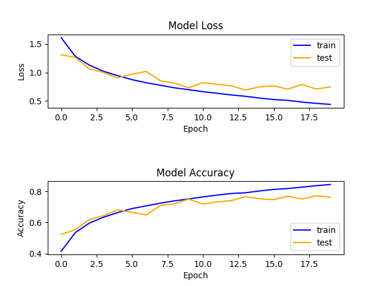

# CIFAR10_Project
Repository for a classifier on the CIFAR-10 dataset

## Working with the repository

In order to use this repository, you should:

- Create a virtual environment for the project:
    ```bash
    virtualenv venv -p python3.6
    ```

- Activate your virtual environment:
    ```bash
    source venv/bin/activate
    ```

- Install dependencies:
    ```bash
    pip install -r requirements.txt
    ```

In order to train the model on the CIFAR-10 dataset:

- Run the train_main.py file:
    ```bash
    cd [root of project]
    python train_main.py
    ```

In order to use a trained model to predict an image's class:

- Run the predict_main.py file:
    ```bash
    cd [root of project]
    python predict_main.py
    ```

## CNN Model

For this project, I ended up using a simple CNN model inspired by the VGG models that is made up of 2 blocks, each block containing:
- two 2D Convolutional layers that use:
    * 32 and 64 filters for the first and second blocks
    * (3,3) size filters
    * Rectified Linear Unit (ReLU) activation
    * He uniform variance scaling initializer
    * padding to be sure that the shape of the outputs matches that of the inputs
- a Batch Normalization layer to accelerate training process
- a 2D Polling Layer that downscales the image by 2 horizontally and vertically
- a Dropout Layer to add some regularization to the model. I added more dropout to the second block than to the first

These blocks are followed by a classifier that is made of:
- a Flatten layer to flatten the input for the following Dense layer
- a first Dense layer which is a usual fully connected neural network layer with ReLU activation
- a final Dense layer that generates predictions with a softmax activation

The model is compiled with:
- Stochastic Gradient Descent Optimizer with learning rate and momentum defined in parameters file
- a categorical crossentropy loss because we have a multi-class classification task
- an accuracy metric because the classes are evenly distributed within the dataset

I trained the model by using:
- a batch size and number of epochs defined in the parameters file
- shuffling of the training data before each epoch

## Results

With this model, trained with batch_size = 32 and epochs = 50, I obtained the following results:

    - Loss = 0.74
    - Accuracy =  0.76

