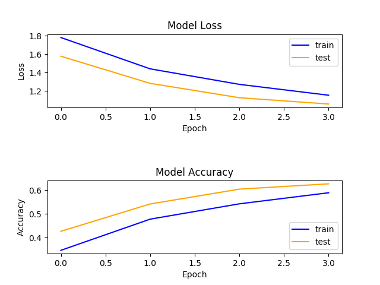

# CIFAR10_Project
Repository for a classifier on the CIFAR-10 dataset

## Working with the repository

In order to use this repository, you should:

- Create a virtual environment for the project:
    ```bash
    virtualenv venv -p python3.6
    ```

- Activate your virtual environment:
    ```bash
    source venv/bin/activate
    ```

- Install dependencies:
    ```bash
    pip install -r requirements.txt
    ```

In order to train the model on the CIFAR-10 dataset:
    ```bash
    cd [root of project]
    python main.py
    ```

## CNN Model

For this project, I ended up using a simple CNN model ...


## Results

With this model, trained with batch_size = 32 and epochs = 50, I obtained the following results:

    - Loss =
    - Accuracy =

